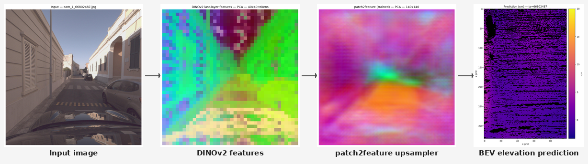

# RoadHeightFormer (RHF)

RoadHeightFormer (RHF) is a monocular road surface elevation estimation framework that builds on the Bird's Eye View pipeline introduced by RoadBEV. It replaces the EfficientNet encoder with a frozen DINOv2 ViT-S/14 backbone, adds a patch2feature upsampler to recover spatial resolution, and trains with a composite loss combining L1, multi-scale gradient, and surface-normal terms. Evaluated on the CARDSet dataset, RHF achieves approximately **30% improvement in absolute error over RoadBEV**.

## Key Files & Folders

| Path | Description |
|---|---|
| `train.py` | Main training loop — loss, optimiser, checkpointing, and logging |
| `models/model_dinov2_fb.py` | RHF model: frozen DINOv2 encoder + patch2feature upsampler + BEV elevation head |
| `models/structural_losses.py` | Composite loss: L1/MSE + multi-scale gradient + surface-normal cosine |
| `cardset/dataset.py` | CARDSet dataloader — preprocessed pkls, voxel UV projection indices, augmentation |
| `utils/metric.py` | Metrics: AbsErr, RMSE, LE90, GradErr, ratio thresholds (0.1 / 0.5 / 1.0 cm) |
| `eval_all_finals.py` | Batch-evaluates every `final_*.pt` checkpoint on the CARDSet val split |
| `configs/config_freeze_baseline.yaml` | Baseline RHF config: frozen DINOv2, composite loss, regression head |
| `models/ele_head.py` | BEV elevation prediction head (classification or regression) |
| `utils/normals.py` | Surface-normal computation from 3-D point clouds (used by structural loss) |
| `models/model.py` | RoadBEV / DA3 baseline model (EfficientNet / DepthAnything3 backbone) |

## Evaluation Scripts

All eval scripts share the same structure: define a `RUNS` list of `(label, checkpoint, config)` tuples, build the model from config, run inference over the val split using `utils/metric.py`, and print a markdown table of results (also saved as JSON).

| Script | What it compares |
|---|---|
| `eval_all_finals.py` | Every `final_*.pt` checkpoint on the CARDSet val split — main ablation table |
| `eval_rhf_vs_da3_per_sample.py` | RHF baseline vs DA3-SMALL per sample (with scale+shift alignment for DA3) |
| `eval_da3_aligned_full.py` | DA3-SMALL with per-image scale+shift alignment on the full val split |
| `eval_da3metric_large.py` | DA3-METRIC-LARGE (metric depth, no alignment needed) on the CARDSet val split |
| `eval_rsrd_baseline_vs_roadbev.py` | RHF baseline vs RoadBEV on the RSRD-dense test split |
